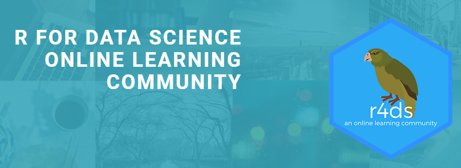

```{r setup, include=FALSE}
knitr::opts_chunk$set(echo = FALSE)
```

## R for Data Science

```{r, echo=FALSE, out.width="300px", fig.align = "center"}
knitr::include_graphics("img/r4dsbook.png")
```

Source: [R4DS online book](https://r4ds.had.co.nz/)

---

## R4DS community

```{r, echo=FALSE, out.width="700px", fig.align = "center"}

```

Source: [rfordatasci.com](https://www.rfordatasci.com/)

---

## tidytuesday

```{r, echo=FALSE, out.width="700px", fig.align = "center"}
knitr::include_graphics("img/ttlogo.png")
```

Source: [tidytuesday GitHub](https://github.com/rfordatascience/tidytuesday)

---

## NSC-R workshops

- Fundamental skills
- Diverse datasets
- Frequent 
- Repetitive
- Less structured 

---

## This week: visualisation

```{r, echo=FALSE, out.width="300px", fig.align = "center"}
knitr::include_graphics("img/starbucks_logo.png")
```
 
<center>

**What is the relationship between fat and calories in Starbucks drinks?**

**How might this relationship differ between drink options (e.g., milk types)?**